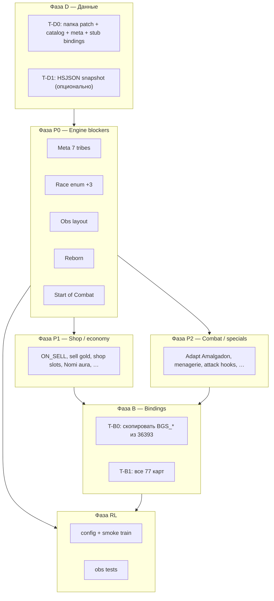

# Patch 74257 — план миграции (backlog тикетов)

Документ для **разработчиков и ревью**: что нужно сделать, чтобы симулировать и обучать на патче **19.6.0 / build 74257**, а не на текущем эталоне **15.6.2 / build 36393**.

Если непонятен какой-то тикет — сначала прочитай [Как читать тикет](#как-читать-тикет) и [Слои работ](#слои-работ). Детали формата patch package — в [patch_package.md](./patch_package.md).

**Источник карт:** [HSJSON 74257](https://api.hearthstonejson.com/v1/74257/enUS/cards.json)

### Аудит статусов (2026-05-23, сверен с кодом)

| | Кол-во |
|---|--------|
| ✅ выполнено | 32 / 32 |
| 🔶 частично (infra без полного retail / coverage) | 0 |
| ❌ не сделано | 0 |
| ❓ неоднозначность | |

**74257 package:** `data/bgcore/19_6_0_74257/` — catalog, meta (7 tribes), **115** EFFECTS keys (**77/77** `BGS_*` pool bound + legacy); **18** `TOKEN_IDS`; **6** `KEYWORD_ONLY_POOL_IDS`.  
**Pool:** `pool_ids=127` (`isBaconPoolMinion`), из них **77** `BGS_*` native.  
**Obs:** `SHOP_ROTATION_OBS_DIM=8`, `RACE_ONEHOT_DIM=9`, `SLOT_DIM=70`; bglike `OBS_DIM=1661`, minibg `OBS_DIM=1801` (из `obs.py`, не yaml). Старые ckpt несовместимы.

**Тесты:** `tests/test_patch_74257.py` (70 tests), `tests/test_patch_obs_net.py` (36393 + 74257 layout). Полный suite: **507 passed** (после fix `recruitment_triples` shadowing в `PlayerTurnEngine.apply`).

**P0 (вне тикетов, 2026-05-23):** локальный `from … import triples as recruitment_triples` внутри `apply()` затенял модульный импорт → `NameError` на BUY/SELL lambdas; исправлено удалением локального import.

---

## С чего начать (30 секунд)

| Вопрос | Ответ |
|--------|--------|
| Что такое 74257? | Другой набор карт и правил rotation (7 племён вместо 4, 77 миньонов в pool). |
| Что такое «тикет»? | Одна **законченная единица работы** в коде: новый trigger, поле в state, расширение obs и т.д. |
| Что такое bindings? | Python-файл, где для каждой карты прописано «что она делает» (`card_id → список Ability`). |
| Можно ли дообучить ckpt с 36393? | **Нет** — другой pool, другой `num_pool_indices`, другой `OBS_DIM` (после T-P0-03). |
| Что уже работает на 36393? | Patch-aware runtime: `PatchContext` обязателен, obs берёт rotation/card index из `game._patch`. |

---

## 36393 vs 74257 — в чём разница

| | **36393** (сейчас) | **74257** (цель) |
|---|-------------------|------------------|
| Patch / build | 15.6.2 / 36393 | 19.6.0 / 74257 |
| Карт в tavern pool | 81 | 77 |
| Племён в rotation | 4 (Beast, Demon, Mech, Murloc) | 7 (+ Dragon, Pirate, Elemental) |
| Активных племён в shop | 3 (одно исключено) | 6 (одно исключено) |
| Adapt в pool | Megasaur (модалка) — **нет в 74257 pool** | Amalgadon (random self-adapt, **без модалки**) |
| Generic Discover | нет | нет (только Primalfin → Discover Murloc) |
| Reborn | нет в engine | нужен (Bronze Warden и др.) |
| Start of Combat | нет отдельного trigger | нужен (Red Whelp и др.) |

**Принцип миграции:** общий **effect engine** (`bg_core`, `bg_recruitment`, `bg_combat`) один на все патчи. Меняются только **данные** (`catalog.json`, `meta.json`) и **bindings** (`bindings.py`).

---

## Слои работ

Работа идёт снизу вверх. Нельзя «просто написать bindings» для карты, если engine не умеет её механику.



| Слой | Префикс | Смысл |
|------|--------|--------|
| **Данные** | `T-D*` | Файлы в `data/bgcore/19_6_0_74257/` — без них `PatchContext.load()` не поднимется. |
| **Engine** | `T-P*` | Код симуляции: triggers, effects, поля state, combat/shop логика. **Один раз** — потом переиспользуется в bindings. |
| **Bindings** | `T-B*` | Привязка конкретных `card_id` к уже существующим effects. |
| **RL** | `T-RL*` | Config, obs dim, smoke training. |

---

## Глоссарий

| Термин | Значение |
|--------|----------|
| **Patch package** | Папка `data/bgcore/{version}_{build}/` с `catalog.json`, `meta.json`, `bindings.py`. |
| **PatchContext** | Runtime-объект после `load(patch_dir)`: templates, effects, meta, `card_id_to_dense`, `num_pool_indices`. |
| **Pool / tavern pool** | Миньоны, которые могут выпасть в shop (не tokens, не golden templates). |
| **Rotation tribes** | Племена, участвующие в rotation; одно исключается → в shop только 6 из 7. |
| **Trigger** | *Когда* срабатывает способность: `ON_PLACE`, `ON_DEATH`, `ON_SELL`, `ON_START_OF_COMBAT`, … |
| **Effect** | *Что* делает способность: summon, buff, discover, adapt, … (dataclass в `bg_core/effects.py`). |
| **Ability** | Пара `(trigger, effect)` на миньоне. |
| **Bindings** | `EFFECTS["BGS_069"] = (Ability(...), ...)` — авторский код эффектов карты. |
| **Modal / pending_choice** | Игра ждёт выбор игрока (Discover, Adapt Megasaur, pick target). |
| **Obs / observation** | Вектор состояния для нейросети; layout в `src/envs/minibg/obs.py`. |

---

## Что уже сделано (36393 baseline)

Это **не тикеты 74257**, но важно понимать текущую базу:

- Patch обязателен end-to-end (`require_patch`, без silent `default_patch_context()` в runtime).
- `build_observation(..., patch=game._patch)` — card index и **rotation globals** из meta **этого** патча.
- Training: `patch_dir` / `num_pool_indices` / guard на mismatch в checkpoint.
- Obs layout расширен под 74257: `SHOP_ROTATION_OBS_DIM=8` (7 one-hot + ratio), Dragon/Pirate/Elemental в race one-hot — см. [T-P0-03](#t-p0-03-obs-races) ✅.

---

## Как читать тикет

Каждый тикет ниже содержит:

| Поле | Зачем |
|------|--------|
| **Простыми словами** | Что видит игрок в HS BG, без жаргона кодовой базы. |
| **Сейчас в коде** | Что уже есть / чего нет. |
| **Сделать** | Конкретные файлы, типы, функции. |
| **Карты 74257** | Примеры карт, для которых **нужен** этот тикет (не полный список bindings). |
| **Done when** | Как проверить, что тикет закрыт (тест или команда). |
| **Depends** | Что должно быть готово раньше. |
| **Решение** | Архитектурный выбор, если был ❓ (см. блоки «Решение» в тикетах). |

**Приоритет:** P0 = без этого патч не собрать; P1 = shop/economy; P2 = combat и редкие механики; bindings = после engine.

**🔶 частично** = engine/infra готов, но retail-карты не работают (нет bindings, catalog parse, или player action).

---

## Оглавление

**Легенда:** ✅ выполнено · 🔶 частично · ❌ не сделано · ~~❓~~ → см. **Решение** в тикете

| ID | Название | Приоритет | Статус |
|----|----------|-----------|--------|
| [T-D0](#t-d0-patch-package-scaffold) | Patch package scaffold | P0 | ✅ |
| [T-D1](#t-d1-hsjson-snapshot) | HSJSON snapshot (CI) | optional | ✅ |
| [T-P0-01](#t-p0-01-meta-7-tribes) | Meta: 7 tribes rotation | P0 | ✅ |
| [T-P0-02](#t-p0-02-race-enum) | Race: Dragon / Pirate / Elemental | P0 | ✅ |
| [T-P0-03](#t-p0-03-obs-races) | Obs: race onehot + rotation | P0 | ✅ |
| [T-P0-04](#t-p0-04-reborn) | Keyword Reborn | P0 | ✅ |
| [T-P0-05](#t-p0-05-start-of-combat) | Trigger Start of Combat | P0 | ✅ |
| [T-P1-01](#t-p1-01-on-sell) | Trigger ON_SELL | P1 | ✅ |
| [T-P1-02](#t-p1-02-sell-gold-override) | Per-minion sell gold | P1 | ✅ |
| [T-P1-03](#t-p1-03-shop-costs) | Dynamic shop costs | P1 | ✅ |
| [T-P1-04](#t-p1-04-on-friendly-bought) | Board listener: on buy | P1 | ✅ |
| [T-P1-05](#t-p1-05-shop-slots) | Shop slot manipulation | P1 | ✅ |
| [T-P1-06](#t-p1-06-shop-tribe-aura) | Shop tribe buff aura (Nomi) | P1 | ✅ |
| [T-P1-07](#t-p1-07-shop-freeze-state) | Per-slot shop freeze state | P1 | ✅ |
| [T-P2-01](#t-p2-01-unique-tribes) | Helper: count unique tribes | P2 | ✅ |
| [T-P2-02](#t-p2-02-adapt-amalgadon) | Adapt: Amalgadon (random, self) | P2 | ✅ |
| [T-P2-03](#t-p2-03-conditions) | Effect preconditions | P2 | ✅ |
| [T-P2-04](#t-p2-04-last-combat-won) | Flag: won last combat | P2 | ✅ |
| [T-P2-05](#t-p2-05-counters) | Runtime counters | P2 | ✅ |
| [T-P2-06](#t-p2-06-attack-hooks) | Combat: after attack hooks | P2 | ✅ |
| [T-P2-07](#t-p2-07-defense-hooks) | Combat: when attacked hooks | P2 | ✅ |
| [T-P2-08](#t-p2-08-shield-lost) | Listener: shield lost | P2 | ✅ |
| [T-P2-09](#t-p2-09-menagerie) | Menagerie battlecry | P2 | ✅ |
| [T-P2-10](#t-p2-10-consume-friendly) | Consume friendly battlecry | P2 | ✅ |
| [T-P2-11](#t-p2-11-last-opponent-board) | Last opponent warband snapshot | P2 | ✅ |
| [T-P2-12](#t-p2-12-after-friendly-battlecry) | After friendly battlecry played | P2 | ✅ |
| [T-P2-13](#t-p2-13-hand-tokens) | Hand tokens (Gold Coin) | P2 | ✅ |
| [T-P2-14](#t-p2-14-tokens) | Token templates in patch | P2 | ✅ |
| [T-B0](#t-b0-reuse-bgs-bindings) | Reuse BGS_* bindings | bindings | ✅ |
| [T-B1](#t-b1-full-bindings) | Full pool bindings | bindings | ✅ |
| [T-RL0](#t-rl0-training-smoke) | Training smoke | RL | ✅ |
| [T-RL1](#t-rl1-obs-tests) | Obs / patch tests | RL | ✅ |

**Не нужны для 74257:** modal Adapt (Megasaur), generic Discover — [Out of scope](#out-of-scope).

**Уже в engine (~26 карт «Whenever / end of turn»):** нужны только bindings после P0 — Overkill, Cleave, Magnetic, Zapp, Discover Murloc, tribal auras, стандартные DR/summon.

---

## Фаза D — Данные

Без папки patch симулятор не знает, какие карты существуют и сколько копий в pool.

### T-D0: Patch package scaffold

| | |
|---|---|
| **Статус** | ✅ — `data/bgcore/19_6_0_74257/`; stub `bindings.py`; `PatchContext.load` → build 74257 |
| **Приоритет** | P0 |
| **Простыми словами** | Создать «паспорт» патча 74257: список всех карт, правила rotation, пустой файл эффектов. |
| **Сейчас в коде** | Package + **64** bindings (T-B0). `PatchContext.load` → build 74257. |
| **Сделать** | `data/bgcore/19_6_0_74257/catalog.json` (build script), `meta.json`, `bindings.py` (stub: пустые `EFFECTS`, `TOKEN_IDS`, `GOLDEN_REWARD_IDS`). |
| **Карты 74257** | все 77 pool ids из catalog |
| **Done when** | `PatchContext.load("data/bgcore/19_6_0_74257")` → `build=74257`, `len(pool_ids)=127` (77 `BGS_*`). Тест: `test_patch_74257_loads`. |
| **Depends** | — |

---

### T-D1: HSJSON snapshot

| | |
|---|---|
| **Статус** | ✅ — `data/minibg/cards_74257_raw.json`; catalog ссылается на него |
| **Приоритет** | optional |
| **Простыми словами** | Сохранить JSON карт локально, чтобы CI собирал catalog без интернета. |
| **Сейчас в коде** | Script `build_minibg_patch_catalog.py` умеет `--hsjson`. |
| **Сделать** | `data/minibg/cards_74257_raw.json` |
| **Done when** | `build_minibg_patch_catalog.py --hsjson ...` ≡ catalog из live API. |
| **Depends** | — |

---

## Фаза P0 — Engine blockers

Без P0 нельзя честно играть lobby на 74257: не те tribes, не те obs, нет Reborn / Start of Combat.

### T-P0-01: Meta 7 tribes

| | |
|---|---|
| **Статус** | ✅ — `meta.json` 74257: 7 tribes, `cnt_active_shop_tribes=6`; runtime из `patch.meta` |
| **Приоритет** | P0 |
| **Простыми словами** | В retail 74257 в rotation **7** племён; в shop каждый ход **6** (одно случайно исключено). В 36393 — 4 и 3. |
| **Сейчас в коде** | `meta.json` 74257 готов; game читает `patch.meta.rotation_tribes`. |
| **Сделать** | `meta.json` для 74257: `rotation_tribes` = BEAST, DEMON, MECHANICAL, MURLOC, DRAGON, PIRATE, ELEMENTAL; `rotation_excluded_count: 1`; `pool_copies_by_tier` как в 36393. |
| **Карты 74257** | все tribal cards (фильтр shop по race) |
| **Done when** | `active_shop_tribe_count() == 6` при load 74257; shop не предлагает исключённое племя. |
| **Depends** | T-D0 |

---

### T-P0-02: Race enum

| | |
|---|---|
| **Статус** | ✅ — `Race.DRAGON/PIRATE/ELEMENTAL`; mapping в catalog и `hs_race_string` |
| **Приоритет** | P0 |
| **Простыми словами** | Engine должен знать племена Dragon, Pirate, Elemental — не только Beast/Demon/Mech/Murloc. |
| **Сейчас в коде** | Enum и parsers готовы. Тест: `test_patch_74257_dragon_race_in_catalog`. |
| **Сделать** | `Race.DRAGON`, `PIRATE`, `ELEMENTAL` в `minion.py`; mapping в `patch_catalog.race_from_hs_string()`; reverse в `summon_pool.hs_race_string()`. Audit: `cards.py`, `battle.py`, `shop_triggers.py`, `discover_pool.py`. |
| **Карты 74257** | Red Whelp, Sellemental, Scallywag, … (~40+ tribal) |
| **Done when** | catalog `"race": "DRAGON"` → `Minion.race == Race.DRAGON`; tribe filters в shop/combat работают. |
| **Depends** | T-D0 |

---

### T-P0-03: Obs races

| | |
|---|---|
| **Статус** | ✅ — `_RACE_ORDER` = 9, `SHOP_ROTATION_OBS_DIM=8`, `OBS_DIM` согласован с тестами и `obs.py` |
| **Приоритет** | P0 (для RL) |
| **Простыми словами** | Нейросеть смотрит на obs-вектор. В каждом слоте minion — race one-hot на **8** категорий (+ neutral, ALL); rotation — **7** one-hot + ratio. |
| **Сейчас в коде** | Layout расширен; rotation из `patch.meta`. Тесты: `test_obs_encodes_elemental_race_74257`, `test_shop_rotation_74257_excluded_dragon`. |
| **Сделать** | ~~Расширить layout~~ (готово). Опционально: отдельный yaml/net config для 74257 training (T-RL0). |
| **Карты 74257** | любая Elemental / Dragon / Pirate в obs |
| **Done when** | encode Elemental → свой race channel; excluded DRAGON → one-hot на правильном индексе; `OBS_DIM` согласован с net/tests. |
| **Depends** | T-P0-02 |

**Историческая проблема (исправлена):** rotation = 7 племён, excluded = DRAGON (индекс 4) — при `SHOP_ROTATION_OBS_DIM=5` one-hot был пустой.

> **Решение:** **фиксированный layout под max patch** (`SHOP_ROTATION_OBS_DIM=8`, расширенный `_RACE_ORDER`). Не выводить `OBS_DIM` из `patch.meta` в runtime — сеть режет вектор по фиксированным offsets, ckpt несовместим при смене dim. Размер берётся из `obs.py` при train startup (`obs_sizing.py`), не из yaml. Для 36393 на том же layout — padding в rotation-слотах.

---

### T-P0-04: Reborn

| | |
|---|---|
| **Статус** | ✅ — combat reborn + obs channel; тесты incl. Bronze Warden catalog |
| **Приоритет** | P0 |
| **Простыми словами** | Reborn: миньон один раз после смерти в **бою** возвращается с 1 HP (как в retail). |
| **Сейчас в коде** | `Keyword.REBORN`, `_try_reborn` в `battle.py`, parse из catalog. **Bindings** для карт — T-B1. |
| **Сделать** | `Keyword.REBORN`; parse в `keywords_for_tavern_record()`; `BattleMinion.reborn_consumed`; respawn в `battle.py`; +1 keyword channel в obs. |
| **Карты 74257** | Acolyte of C'Thun, Bronze Warden |
| **Done when** | Test: reborn dies → 1 HP в том же слоте; второй death — обычный; DR по retail rules. |
| **Depends** | — |

---

### T-P0-05: Start of Combat

| | |
|---|---|
| **Статус** | ✅ — engine готов; Red Whelp effect — в bindings (T-B1) |
| **Приоритет** | P0 |
| **Простыми словами** | Некоторые эффекты срабатывают **в начале боя**, после расстановки, **до первого удара**. Это не shop `ON_TURN_START`. |
| **Сейчас в коде** | `Trigger.ON_START_OF_COMBAT`, `_fire_start_of_combat()` до attack loop. Тест: `test_start_of_combat_damages_enemy_before_attacks`. |
| **Сделать** | `Trigger.ON_START_OF_COMBAT`; `_fire_start_of_combat()` в `simulate_battle()` до attacks; combat dispatch; trigger channel в obs. |
| **Карты 74257** | Red Whelp — 1 damage per friendly Dragon to random enemy |
| **Done when** | SOC damage до первого swing; не firing в shop phase. |
| **Depends** | T-P0-02 (Dragon count для Red Whelp) |

---

## Фаза P1 — Shop и economy

Механики **магазина**: продажа, цены, слоты, реакция доски на покупки.

### T-P1-01: ON_SELL

| | |
|---|---|
| **Статус** | ✅ — `Trigger.ON_SELL`, `fire_on_sell`, `sell_from_board(on_sell=…)`; Sellemental binding + test |
| **Приоритет** | P1 |
| **Простыми словами** | При **продаже** миньона с доски срабатывает его эффект (например, положить token в hand или баффнуть shop). |
| **Сейчас в коде** | `fire_on_sell` в `ShopTriggers`; wired в `engine.py` / `economy.sell_from_board`. Тест: `test_on_sell_sellemental_adds_token_to_hand`. **Steward buff shop** — ждёт T-P1-05. |
| **Сделать** | `Trigger.ON_SELL`; dispatch в `sell_from_board()` **до** удаления с board; handler в `ShopTriggers`. |
| **Карты 74257** | Sellemental (token in hand), Steward of Time (buff shop) |
| **Done when** | Sell Sellemental → token in hand; порядок pool/gold корректен. |
| **Depends** | T-P1-05 (Steward buff shop) |

> **≠ T-P1-02:** Freedealing Gambler — не «эффект при продаже», а «продаётся за 3 gold».

---

### T-P1-02: Sell gold override

| | |
|---|---|
| **Статус** | ✅ — `sell_value_from_catalog_text()` + `Minion.sell_value`; Freedealing Gambler → 3 |
| **Приоритет** | P1 |
| **Простыми словами** | Обычно sell = +1 gold. У некоторых карт **другая** цена продажи. |
| **Сейчас в коде** | Catalog parse «sells for N Gold»; `effective_sell_reward`. Тест: `test_freedealing_gambler_sell_value_from_catalog`. |
| **Сделать** | Парсить sell value из catalog text **или** binding/field на template; затем интеграционный тест sell → +3 gold. |
| **Карты 74257** | Freedealing Gambler — sells for 3 Gold |
| **Done when** | Sell Gambler → +3 gold; остальные → +1. |
| **Depends** | — |

---

### T-P1-03: Shop costs

| | |
|---|---|
| **Статус** | ✅ — effects + bindings `BGS_055`/`BGS_116`; BC-тесты Deck Swabbie / Refreshing Anomaly |
| **Приоритет** | P1 |
| **Простыми словами** | Карты меняют стоимость **upgrade tavern** или **refresh shop** (не разово, а «следующий roll 0»). |
| **Сейчас в коде** | `effective_roll_cost`, `effective_level_up_cost`, `ReduceUpgradeCostEffect`, `SetNextRollCostEffect`. Тесты: `test_effective_shop_cost_overrides`, `test_deck_swabbie_reduces_level_up_cost`, `test_refreshing_anomaly_sets_next_roll_free`. |
| **Сделать** | Bindings Deck Swabbie / Refreshing Anomaly; интеграционные тесты BC → cost change. |
| **Карты 74257** | Deck Swabbie (upgrade −1), Refreshing Anomaly (next refresh 0) |
| **Done when** | Swabbie BC → дешевле level up; Anomaly → следующий roll 0 gold. |
| **Depends** | — |

---

### T-P1-04: On friendly bought

| | |
|---|---|
| **Статус** | ✅ — `ON_FRIENDLY_BOUGHT`, `fire_on_friendly_bought`, Hoggarr binding + test |
| **Приоритет** | P1 |
| **Простыми словами** | Миньон **на доске** реагирует, когда ты **покупаешь** другого миньона в shop (не когда его играешь). |
| **Сейчас в коде** | `buy_from_shop(on_friendly_bought=…)`; board scan в `ShopTriggers`. Тест: `test_on_friendly_bought_hoggarr_grants_gold_for_pirate`. |
| **Сделать** | При buy: scan board; `Trigger.ON_FRIENDLY_BOUGHT` или inline; `GainGoldThisTurnEffect(amount, filter_race)`. |
| **Карты 74257** | Cap'n Hoggarr — buy Pirate → +1 gold this turn |
| **Done when** | Hoggarr + buy Pirate → +1 gold; buy Beast → nothing. |
| **Depends** | T-P0-02 |

---

### T-P1-05: Shop slots

| | |
|---|---|
| **Статус** | ✅ — Stasis/Steward/Faceless modal (`TRANSFORM_SHOP_MINION` + BUY_SLOT pick) + tests |
| **Приоритет** | P1 |
| **Простыми словами** | Эффекты работают с **offers в shop**, не с board: добавить миньона в slot, баффнуть все offers, скопировать offer. |
| **Сейчас в коде** | `add_random_minion_to_shop`, `BuffAllShopOffersEffect`, `TransformIntoShopMinionEffect`, `toggle_shop_slot_frozen`, `faceless.py` modal. Bindings: `BGS_122`, `BGS_037`, `BGS_113`. |
| **Сделать** | `add_random_minion_to_shop(race, freeze_slot)`; `BuffAllShopOffersEffect`; modal pick shop slot; `TransformIntoShopMinionEffect`. `PendingChoiceKind.CHOOSE_SHOP_SLOT` или reuse picker. |
| **Карты 74257** | Stasis Elemental; Steward; Faceless Taverngoer |
| **Done when** | Stasis fills slot + frozen; Faceless modal → transform self into copy. |
| **Depends** | T-P1-07, T-P2-03 (Faceless modal) |

---

### T-P1-06: Shop tribe aura

| | |
|---|---|
| **Статус** | ✅ — `shop_elemental_bonus`, `fill_shop_slot` apply, Nomi binding + test |
| **Приоритет** | P1 |
| **Простыми словами** | **Nomi:** каждый раз когда играешь Elemental, все Elementals **в shop** (текущие и будущие) получают +1/+1 навсегда. Buff на shop, не на board. |
| **Сейчас в коде** | `PlayerState.shop_elemental_bonus`; `IncrementShopTribeBonusEffect`; `apply_shop_tribe_bonus_to_minion` в `fill_shop_slot`. Тест: `test_nomi_increments_shop_elemental_bonus`. |
| **Сделать** | `PlayerState.shop_tribe_buff` или counter; apply в `fill_shop_slot`; increment on play Elemental. |
| **Карты 74257** | Nomi |
| **Done when** | After Elemental + Nomi: current and future shop Elementals +N/+N. |
| **Depends** | T-P0-02, T-P2-05 (counter optional) |

---

### T-P1-07: Shop freeze state

| | |
|---|---|
| **Статус** | ✅ — `FREEZE_SHOP_SLOT_0..5`, `toggle_shop_slot_frozen`, engine + env wiring; Stasis freeze |
| **Приоритет** | P1 |
| **Простыми словами** | Заморозить **конкретный slot** shop, чтобы при reroll offer остался. |
| **Сейчас в коде** | `shop_frozen` + `refresh_shop(frozen_slots=...)`. Player action `FREEZE_SHOP_SLOT_*` в engine/env. Тесты: `test_shop_frozen_slot_survives_roll`, `test_toggle_shop_slot_frozen`. |
| **Сделать** | Player action или card effect (Stasis) выставляет `shop_frozen[i]=True`. |
| **Карты 74257** | Stasis Elemental |
| **Done when** | Frozen slot survives roll; unfrozen refresh. |
| **Depends** | — |

> **Решение:** переиспользовать **`PlayerState.shop_frozen[]`** — отдельной семантики freeze не нужно. Stasis (T-P1-05): add minion to shop slot + `shop_frozen[i] = True`. Infra (`refresh_shop(frozen_slots=...)`, game wiring) уже есть.

---

## Фаза P2 — Combat и спецэффекты

Редкие battlecry/combat hooks, без которых часть tier 5–6 не работает.

### T-P2-01: Unique tribes

| | |
|---|---|
| **Статус** | ✅ — `count_unique_tribes()` / `minion_matches_tribe()` в `board_helpers.py` |
| **Приоритет** | P2 |
| **Простыми словами** | Helper: сколько **разных** племён на доске (для Amalgadon, Menagerie, …). |
| **Сделать** | `count_unique_tribes(board, exclude_self)`; policy для `Race.ALL` / neutral. |
| **Карты 74257** | Amalgadon, Mythrax, Lightfang, Menagerie Mug/Jug |
| **Done when** | Beast+Murloc+Dragon → 3; self excluded для Amalgadon. |
| **Depends** | T-P0-02 |

---

### T-P2-02: Adapt Amalgadon

| | |
|---|---|
| **Статус** | ✅ — `AdaptSelfRandomEffect`; dispatch в `fire_on_place`; Amalgadon binding + test |
| **Приоритет** | P2 |
| **Простыми словами** | **Единственный Adapt в pool 74257.** При play Amalgadon получает N **случайных** adapt на себя, где N = число **других** племён на доске. **Без модалки** (не Megasaur). |
| **Сделать** | `AdaptSelfRandomEffect(count_from_unique_other_tribes=True)`; loop random `ADAPT_KEYS_ALL`; golden = 2× per tribe. **Не** `AdaptAllMurlocsEffect` / modal. |
| **Карты 74257** | Amalgadon `BGS_069` |
| **Done when** | 2 other tribes → 2 random adapts; no `pending_choice`. |
| **Depends** | T-P2-01 |

---

### T-P2-03: Conditions

| | |
|---|---|
| **Статус** | ✅ — `Condition` / `ConditionKind`, `ability_condition_met()`; Primalfin / Hangry bindings + tests |
| **Приоритет** | P2 |
| **Простыми словами** | Battlecry срабатывает только если условие: «есть другой Murloc», «выиграл прошлый бой», … |
| **Сделать** | `Condition` dataclass; optional `Ability.condition`; skip in dispatchers. |
| **Карты 74257** | Primalfin; Hangry Dragon; Soul Devourer |
| **Done when** | Primalfin без другого Murloc → no Discover. |
| **Depends** | T-P2-04 (Hangry) |

---

### T-P2-04: Last combat won

| | |
|---|---|
| **Статус** | ✅ — `PlayerState.last_combat_won`; set в `round.py` / `eight_player.py` + test |
| **Приоритет** | P2 |
| **Простыми словами** | Флаг «выиграл ли прошлый бой» для shop effects (Hangry Dragon). |
| **Сделать** | `PlayerState.last_combat_won: bool`; set after combat in lobby/round. |
| **Карты 74257** | Hangry Dragon |
| **Done when** | Flag correct after win/loss/tie. |
| **Depends** | — |

---

### T-P2-05: Counters

| | |
|---|---|
| **Статус** | ✅ — `elementals_played` / `pirates_bought_this_turn` reset on turn start; Strongarm, Majordomo, Garr, Lil' Rag bindings + tests |
| **Приоритет** | P2 |
| **Простыми словами** | Счётчики на игроке: сколько Elementals played, Pirates bought this turn, … — effects читают их для scaling. |
| **Сделать** | `PlayerState` counters; increment in place/buy/turn_end. |
| **Карты 74257** | Southsea Strongarm, Majordomo, Goldgrubber, Elemental chains |
| **Done when** | Counters increment; effects read them. |
| **Depends** | — |

---

### T-P2-06: Attack hooks

| | |
|---|---|
| **Статус** | ✅ — `ON_AFTER_ATTACK`, `ON_FRIENDLY_ATTACK`; Macaw/Glyph/Ripsnarl bindings + tests |
| **Приоритет** | P2 |
| **Простыми словами** | После того как миньон **ударил** (не только Overkill): random friendly DR, double attack, … |
| **Сейчас в коде** | Hooks в `_handle_attack_completed`; effects incl. `AddRandomMinionToHandOnKillEffect` (Nat Pagle), `DealExcessDamageToAdjacentEffect` (Wildfire). |
| **Карты 74257** | Monstrous Macaw, Glyph Guardian, Wildfire Elemental, Nat Pagle, Ripsnarl Captain |
| **Done when** | Macaw → **random** friendly DR after attack. |
| **Depends** | — |

---

### T-P2-07: Defense hooks

| | |
|---|---|
| **Статус** | ✅ — `ON_WHEN_ATTACKED`, `ON_FRIENDLY_WHEN_ATTACKED`; Yo-Ho-Ogre + Arm/Champion/Ritualist bindings + tests |
| **Приоритет** | P2 |
| **Простыми словами** | Когда миньона **атакуют** или он **пережил** удар — доп. атака, buff, … |
| **Сейчас в коде** | `_fire_when_attacked()` в `_run_single_swing`; effects `BuffAdjacentOnAttackedEffect`, `BuffAttackedMinionEffect`; `Ability.filter_victim_keyword` для taunt-listeners. |
| **Карты 74257** | Yo-Ho-Ogre, Tormented Ritualist, Arm of the Empire, Champion of Y'Shaarj |
| **Done when** | Ogre survives → attacks again; taunt attacked → Arm/Champion fire. |
| **Depends** | — |

---

### T-P2-08: Shield lost

| | |
|---|---|
| **Статус** | ✅ — `ON_FRIENDLY_SHIELD_LOST` в `_handle_shield_lost`; Drakonid Enforcer binding + test |
| **Приоритет** | P2 |
| **Простыми словами** | Союзник потерял Divine Shield → listener баффает (Drakonid Enforcer). |
| **Сделать** | `Trigger.ON_FRIENDLY_SHIELD_LOST`; расширить `_handle_shield_lost` в `battle.py`: после `_fire_self_damaged` scan board allies (как `_fire_friendly_minion_died_listeners`). |
| **Карты 74257** | Drakonid Enforcer |
| **Done when** | Shield pop → Enforcer +2/+2. |
| **Depends** | — |

> **Решение:** расширить **`_handle_shield_lost`**, не отдельный dispatch path — событие `ShieldLost` уже в combat queue.

---

### T-P2-09: Menagerie

| | |
|---|---|
| **Статус** | ✅ — `BuffRandomUniqueTribeFriendlies`; Mug/Jug bindings + test |
| **Приоритет** | P2 |
| **Простыми словами** | Battlecry: бафф **3 random** friendlies с **разными** tribes (не «по одному с каждого из списка»). |
| **Сделать** | `BuffRandomUniqueTribeFriendlies(count=3, atk, hp)`. |
| **Карты 74257** | Menagerie Mug, Menagerie Jug |
| **Done when** | 3 targets, different tribes when possible. |
| **Depends** | T-P2-01 |

---

### T-P2-10: Consume friendly

| | |
|---|---|
| **Статус** | ✅ — `ConsumeFriendlyBattlecry`, targeted dispatch; `BGS_059` binding + test |
| **Приоритет** | P2 |
| **Простыми словами** | Battlecry: выбрать friendly, **съесть** его, получить stats + gold. |
| **Сделать** | `ConsumeFriendlyBattlecry` + board pick modal. |
| **Карты 74257** | Soul Devourer |
| **Done when** | Pick Demon → removed, Devourer gains stats + 3 gold. |
| **Depends** | T-P2-03 |

---

### T-P2-11: Last opponent board

| | |
|---|---|
| **Статус** | ✅ — `PlayerState.last_opponent_board`, snapshot в `round.py` / `eight_player.py`; Murozond binding + test |
| **Приоритет** | P2 |
| **Простыми словами** | Скопировать миньона из **прошлого** warband оппонента (после боя). |
| **Сделать** | `PlayerState.last_opponent_board: Tuple[Minion, ...]`; записывать в `resolve_combat_round` после `simulate_battle` для каждого live-пара (a,b); `AddFromLastOpponentBoardEffect`. |
| **Карты 74257** | Murozond |
| **Done when** | BC adds minion from last opponent board to hand. |
| **Depends** | 8p combat flow |

> **Решение:** **`PlayerState.last_opponent_board`** после каждого live-боя. **Не** переиспользовать `EliminatedSnapshot.last_board` — тот только для eliminated ghost (Kel'Thuzad), frozen при вылете.

---

### T-P2-12: After friendly battlecry

| | |
|---|---|
| **Статус** | ✅ — battlecry gate + Kalecgos binding; test `test_kalecgos_buffs_dragons_after_friendly_battlecry` |
| **Приоритет** | P2 |
| **Простыми словами** | Когда **другой** friendly с battlecry played → Kalecgos баффает Dragons. |
| **Сделать** | Helper `_placed_has_battlecry(placed)`; generalize gate в `fire_after_friendly_minion_placed`; Kalecgos binding: `BuffAllFriendlyOfTribe(Race.DRAGON)` + `require_placed_battlecry=True` на Ability. **Не** новый trigger. |
| **Карты 74257** | Kalecgos |
| **Done when** | Play BC minion → Kalecgos buffs Dragons; play without BC → no buff. |
| **Depends** | T-P0-02 |

> **Решение:** **фильтр battlecry** на существующем `AFTER_FRIENDLY_MINION_PLACED` (как уже для `BuffSelfWhenFriendlyBattlecryPlaced`). Отклонено: `ON_AFTER_FRIENDLY_BATTLECRY` — лишний obs channel и дублирование dispatch.

---

### T-P2-13: Hand tokens

| | |
|---|---|
| **Статус** | ✅ — stub `GainGoldOnDeathEffect` + `combat_gold_out`; Warden `BGS_200` binding + test |
| **Приоритет** | P2 (можно stub) |
| **Простыми словами** | Deathrattle кладёт в hand **Gold Coin** (не minion). |
| **Сейчас в коде** | Combat DR → +1 gold после боя (`round.py` / `eight_player.py` apply). Полноценный hand spell — out of scope. |
| **Карты 74257** | BGS_200 |
| **Done when** | Documented; stub ok for v1. |
| **Depends** | — |

---

### T-P2-14: Tokens

| | |
|---|---|
| **Статус** | ✅ — `TOKEN_IDS` 18 entries; `test_all_token_ids_instantiate`; all binding-referenced tokens covered |
| **Приоритет** | P2 |
| **Простыми словами** | Summon/add миньонов, которых **нет в tavern pool** (2/2 Elemental, Imp, …). |
| **Сделать** | `TOKEN_IDS` in bindings; catalog entries for tokens. |
| **Карты 74257** | Sellemental token, Imp, Pirate 1/1, … |
| **Done when** | `make_minion(token_id, patch=...)` для всех referenced tokens. |
| **Depends** | T-D0 |

---

## Фаза B — Bindings

Engine умеет механику → в `bindings.py` прописываем **конкретные карты**.

### T-B0: Reuse BGS_* bindings

| | |
|---|---|
| **Статус** | ✅ — 64 EFFECTS rows copied from 36393 overlap + 74257-specific; `check_patch_coverage` 0 errors |
| **Приоритет** | после P0 |
| **Простыми словами** | ~15 карт с тем же `card_id`, что в 36393 — скопировать effects, проверить stats. |
| **Сделать** | Copy `EFFECTS` rows from 36393; сверить stats/text с 74257 catalog. |
| **Done when** | Overlap ids bound; no stale numbers. |
| **Depends** | T-D0, P0 engine |

---

### T-B1: Full bindings

| | |
|---|---|
| **Статус** | ✅ — **77/77** `BGS_*` pool bound or `KEYWORD_ONLY_POOL_IDS`; legacy `ICC_029`/`ICC_858`/`ULD_217` bound |
| **Приоритет** | incremental |
| **Простыми словами** | Покрыть все 77 pool cards эффектами. |
| **Сделать** | `bindings.py` tier-by-tier; `scripts/check_patch_coverage.py` → 0 errors. |
| **Done when** | Coverage 0 errors; все pool `BGS_*` с bindings или явно keyword-only. |
| **Depends** | relevant engine tickets |

**Keyword-only (no EFFECTS):** `BGS_034`, `BGS_039`, `BGS_049`, `BGS_106`, `BGS_119`, `BGS_131` — см. `KEYWORD_ONLY_POOL_IDS` в `bindings.py`.

---

## Фаза RL

### T-RL0: Training smoke

| | |
|---|---|
| **Статус** | ✅ — `configs/bglike/ppo_structured_v2_74257.yaml`; smoke `train_distributed` 5000 steps |
| **Простыми словами** | Запустить distributed training на 74257 без shape mismatch. |
| **Сделать** | ~~yaml + smoke~~ (готово). |
| **Done when** | `run_distributed.py` starts; rollout без ошибок obs/net. |
| **Depends** | T-D0, T-P0-03 |

---

### T-RL1: Obs tests

| | |
|---|---|
| **Статус** | 🔶 — 36393 guards + 74257 unit/game obs tests; **нет** end-to-end 74257 training |
| **Простыми словами** | CI проверяет obs для **обоих** патчей. |
| **Сделать** | ~~Extend tests~~ (19 tests in `test_patch_74257.py`). Остаётся: Kalecgos / Deck Swabbie integration. |
| **Done when** | CI green for 36393 and 74257 layout **+** optional 74257 training smoke. |
| **Depends** | T-P0-03 |

---

## Порядок работ

```
D0 → P0-01..05 → P1-* (shop) + P2-* (combat) → B0 → B1 → RL
```

**Критический path до «можно играть lobby без RL»:**

1. ~~T-D0, T-P0-01, T-P0-02, T-P0-04, T-P0-05~~ ✅  
2. T-P1-01, T-P1-02 (catalog parse), T-P1-07 (player action), T-P1-05  
3. T-B0 + partial T-B1 (tier 1–2)  

**Критический path до training:**

4. ~~T-P0-03~~ ✅, T-RL0 (yaml `patch_dir=74257`), T-RL1 (74257 smoke)  

---

## Out of scope

| Item | Reason |
|------|--------|
| Modal Adapt (Megasaur) | Not in 74257 pool; 36393 legacy |
| Generic Discover | Only Primalfin (Murloc + condition) |
| Union vocab / ckpt transfer | Per-patch by design |
| Quilboar, Naga, Undead | Not in 74257 pool |
| Hero powers, trinkets, buddies | — |

---

## Уже в engine (только bindings)

Не нужен отдельный engine-тикет — достаточно T-P0-02 + T-B1:

- **Zapp Slywick** — `ZappTargeting`
- **Overkill** — Herald of Flame, Seabreaker Goliath
- **Magnetic** — existing merge flow
- **Discover Murloc** — `DiscoverMurlocEffect` + T-P2-03
- **Tribal listeners** — Mama Bear, Wrath Weaver, Salty Looter, … (~26 cards)
- **Standard DR / summon / aura** — Kaboom Bot-style from 36393

---

## Ссылки

- [patch_74257_retail_normal_fixes.md](./patch_74257_retail_normal_fixes.md) — backlog: retail fidelity normal minions (catalog ↔ engine)  
- [patch_package.md](./patch_package.md) — формат catalog / meta / bindings  
- Эталон: `data/bgcore/15_6_2_36393/`  
- Coverage: `scripts/check_patch_coverage.py`  
- Obs layout: `src/envs/minibg/obs.py`  
- Effects: `src/bg_core/effects.py`
